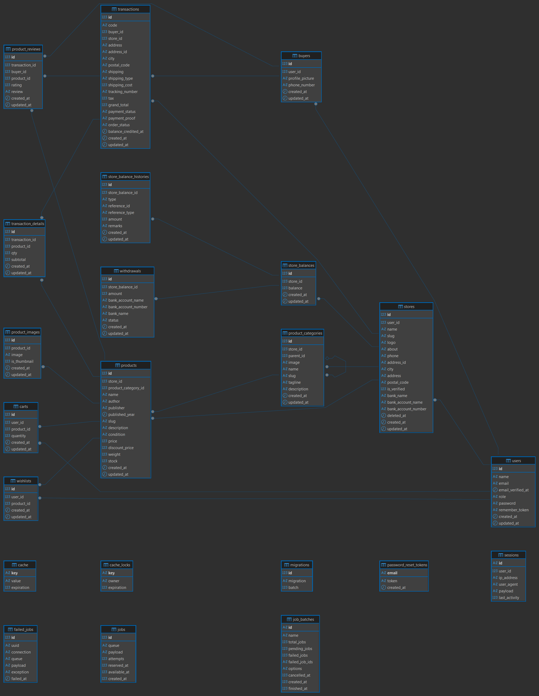

# E-Commerce Kelompok 7

Project E-Commerce ini dibangun menggunakan **Laravel 12** dan **Vite** untuk frontend tooling.

## Struktur Database

Berikut adalah gambaran struktur database (ERD) dari project ini:



## Prasyarat (Prerequisites)

Sebelum memulai, pastikan komputer Anda telah terinstal:

- **PHP** (minimal versi 8.2)
- **Composer**
- **Node.js** & **NPM**
- **MySQL** (atau database lain yang didukung Laravel)

## Instalasi (Installation)

Ikuti langkah-langkah berikut untuk menginstal dan menjalankan project ini di komputer lokal Anda.

### 1. Clone Repository
```bash
git clone https://github.com/sandiv-pemweb/e-commerce-kelompok-7.git
cd e-commerce-kelompok-7
```

### 2. Install PHP Dependencies
Install semua library PHP yang dibutuhkan menggunakan Composer:
```bash
composer install
```

### 3. Setup Environment File
Salin file konfigurasi contoh `.env.example` ke `.env`:
```bash
cp .env.example .env
```
*(Atau `copy .env.example .env` jika menggunakan Command Prompt Windows)*

### 4. Generate Application Key
Generate unique key untuk aplikasi Anda:
```bash
php artisan key:generate
```

### 5. Konfigurasi Database
1. Buat database baru di MySQL (misalnya: `e_commerce_uap`).
2. Buka file `.env` dan sesuaikan konfigurasi database Anda:
   ```env
   DB_CONNECTION=mysql
   DB_HOST=127.0.0.1
   DB_PORT=3306
   DB_DATABASE=e_commerce_uap
   DB_USERNAME=root
   DB_PASSWORD=
   ```

### 6. Migrasi Database & Seeder
Menjalankan migrasi untuk membuat tabel-tabel di database.

**Opsi A: Migrasi Saja (Kosong)**
```bash
php artisan migrate
```

**Opsi B: Migrasi + Data Dummy (Disarankan)**
Untuk mengisi database dengan data awal (contoh produk, user admin, penjual, dll), jalankan perintah berikut. Ini akan menghapus semua data lama dan menggantinya dengan data baru (fresh):
```bash
php artisan migrate:fresh --seed
```
*Tips: Gunakan opsi ini jika Anda ingin langsung melihat tampilan aplikasi yang terisi penuh.*

### 7. Install Frontend Dependencies
Install library JavaScript yang dibutuhkan:
```bash
npm install
```

### 8. Build Assets
Compile aset frontend (CSS/JS) untuk development:
```bash
npm run build
```
*(Atau gunakan `npm run dev` jika ingin mode live-reload, lihat bagian "Menjalankan Aplikasi")*

## Menjalankan Aplikasi (Running the App)

Untuk menjalankan server development (Laravel server + Vite + Queue Worker) secara bersamaan:

```bash
composer run dev
```

Atau jika ingin menjalankan secara terpisah:

```bash
# Terminal 1: Laravel Server
php artisan serve

# Terminal 2: Vite Development Server
npm run dev
```

Akses aplikasi di: [http://localhost:8000](http://localhost:8000)

## Akun Default (Seeder)

Jika Anda menjalankan `php artisan migrate:fresh --seed`, berikut adalah akun default yang dapat digunakan:

| Role | Email | Password |
|------|-------|----------|
| **Admin** | admin@example.com | password |
| **Seller (Verified)** | seller1@example.com | password |
| **Seller (Verified)** | seller2@example.com | password |
| **Seller (Verified)** | seller3@example.com | password |
| **Seller (Pending)** | seller4@example.com | password |
| **Member (Buyer)** | buyer1@example.com | password |
| **Member (Buyer)** | buyer2@example.com | password |
| **Member (Buyer)** | buyer3@example.com | password |
